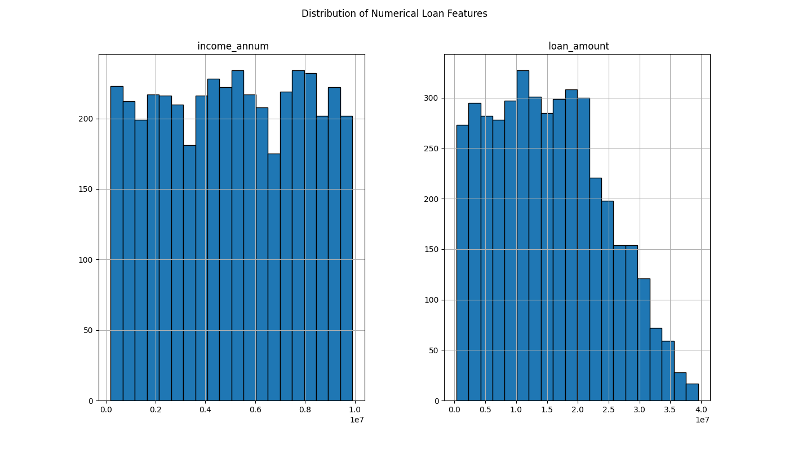

### Summary Statistics
|                  |   count |           mean |            std |    min |        25% |         50% |         75% |         max |      median |        std_dev |       range |     variance |
|:-----------------|--------:|---------------:|---------------:|-------:|-----------:|------------:|------------:|------------:|------------:|---------------:|------------:|-------------:|
| loan_id          |    4269 | 2135           | 1232.5         |      1 | 1068       | 2135        | 3202        | 4269        | 2135        | 1232.5         | 4268        |  1.51905e+06 |
| no_of_dependents |    4269 |    2.49871     |    1.69591     |      0 |    1       |    3        |    4        |    5        |    3        |    1.69591     |    5        |  2.87611     |
| income_annum     |    4269 |    5.05912e+06 |    2.80684e+06 | 200000 |    2.7e+06 |    5.1e+06  |    7.5e+06  |    9.9e+06  |    5.1e+06  |    2.80684e+06 |    9.7e+06  |  7.87835e+12 |
| loan_amount      |    4269 |    1.51335e+07 |    9.04336e+06 | 300000 |    7.7e+06 |    1.45e+07 |    2.15e+07 |    3.95e+07 |    1.45e+07 |    9.04336e+06 |    3.92e+07 |  8.17824e+13 |
| loan_term        |    4269 |   10.9004      |    5.70919     |      2 |    6       |   10        |   16        |   20        |   10        |    5.70919     |   18        | 32.5948      |

