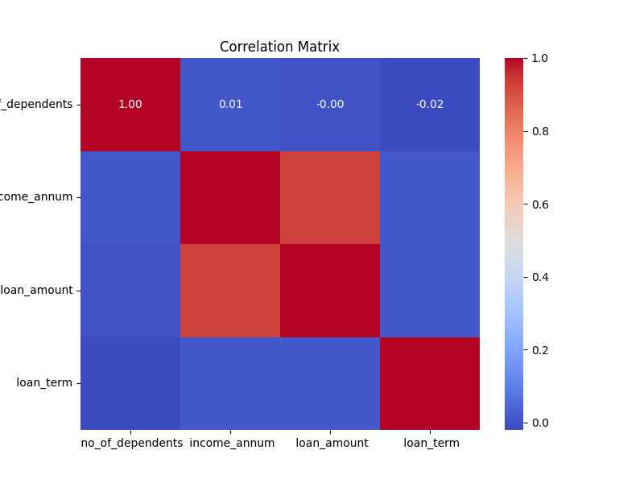

### Summary Statistics
                  count      mean           std       min       25%       50%       75%       max    median       std_dev     range      variance
loan_id             5.0       3.0      1.581139       1.0       2.0       3.0       4.0       5.0       3.0      1.581139       4.0  2.500000e+00
no_of_dependents    5.0       0.8      0.836660       0.0       0.0       1.0       1.0       2.0       1.0      0.836660       2.0  7.000000e-01
income_annum        5.0   70000.0  15811.388301   50000.0   60000.0   70000.0   80000.0   90000.0   70000.0  15811.388301   40000.0  2.500000e+08
loan_amount         5.0  250000.0  79056.941504  150000.0  200000.0  250000.0  300000.0  350000.0  250000.0  79056.941504  200000.0  6.250000e+09
loan_term           5.0      20.0      7.905694      10.0      15.0      20.0      25.0      30.0      20.0      7.905694      20.0  6.250000e+01

### Summary Statistics
                  count      mean           std       min       25%       50%       75%       max    median       std_dev     range      variance
loan_id             5.0       3.0      1.581139       1.0       2.0       3.0       4.0       5.0       3.0      1.581139       4.0  2.500000e+00
no_of_dependents    5.0       0.8      0.836660       0.0       0.0       1.0       1.0       2.0       1.0      0.836660       2.0  7.000000e-01
income_annum        5.0   70000.0  15811.388301   50000.0   60000.0   70000.0   80000.0   90000.0   70000.0  15811.388301   40000.0  2.500000e+08
loan_amount         5.0  250000.0  79056.941504  150000.0  200000.0  250000.0  300000.0  350000.0  250000.0  79056.941504  200000.0  6.250000e+09
loan_term           5.0      20.0      7.905694      10.0      15.0      20.0      25.0      30.0      20.0      7.905694      20.0  6.250000e+01

### Summary Statistics
                  count      mean           std       min       25%       50%       75%       max    median       std_dev     range      variance
loan_id             5.0       3.0      1.581139       1.0       2.0       3.0       4.0       5.0       3.0      1.581139       4.0  2.500000e+00
no_of_dependents    5.0       0.8      0.836660       0.0       0.0       1.0       1.0       2.0       1.0      0.836660       2.0  7.000000e-01
income_annum        5.0   70000.0  15811.388301   50000.0   60000.0   70000.0   80000.0   90000.0   70000.0  15811.388301   40000.0  2.500000e+08
loan_amount         5.0  250000.0  79056.941504  150000.0  200000.0  250000.0  300000.0  350000.0  250000.0  79056.941504  200000.0  6.250000e+09
loan_term           5.0      20.0      7.905694      10.0      15.0      20.0      25.0      30.0      20.0      7.905694      20.0  6.250000e+01

### Summary Statistics
                  count      mean           std       min       25%       50%       75%       max    median       std_dev     range      variance
loan_id             5.0       3.0      1.581139       1.0       2.0       3.0       4.0       5.0       3.0      1.581139       4.0  2.500000e+00
no_of_dependents    5.0       0.8      0.836660       0.0       0.0       1.0       1.0       2.0       1.0      0.836660       2.0  7.000000e-01
income_annum        5.0   70000.0  15811.388301   50000.0   60000.0   70000.0   80000.0   90000.0   70000.0  15811.388301   40000.0  2.500000e+08
loan_amount         5.0  250000.0  79056.941504  150000.0  200000.0  250000.0  300000.0  350000.0  250000.0  79056.941504  200000.0  6.250000e+09
loan_term           5.0      20.0      7.905694      10.0      15.0      20.0      25.0      30.0      20.0      7.905694      20.0  6.250000e+01

### Summary Statistics
                  count      mean           std       min       25%       50%       75%       max    median       std_dev     range      variance
loan_id             5.0       3.0      1.581139       1.0       2.0       3.0       4.0       5.0       3.0      1.581139       4.0  2.500000e+00
no_of_dependents    5.0       0.8      0.836660       0.0       0.0       1.0       1.0       2.0       1.0      0.836660       2.0  7.000000e-01
income_annum        5.0   70000.0  15811.388301   50000.0   60000.0   70000.0   80000.0   90000.0   70000.0  15811.388301   40000.0  2.500000e+08
loan_amount         5.0  250000.0  79056.941504  150000.0  200000.0  250000.0  300000.0  350000.0  250000.0  79056.941504  200000.0  6.250000e+09
loan_term           5.0      20.0      7.905694      10.0      15.0      20.0      25.0      30.0      20.0      7.905694      20.0  6.250000e+01

### Summary Statistics
                  count      mean           std       min       25%       50%       75%       max    median       std_dev     range      variance
loan_id             5.0       3.0      1.581139       1.0       2.0       3.0       4.0       5.0       3.0      1.581139       4.0  2.500000e+00
no_of_dependents    5.0       0.8      0.836660       0.0       0.0       1.0       1.0       2.0       1.0      0.836660       2.0  7.000000e-01
income_annum        5.0   70000.0  15811.388301   50000.0   60000.0   70000.0   80000.0   90000.0   70000.0  15811.388301   40000.0  2.500000e+08
loan_amount         5.0  250000.0  79056.941504  150000.0  200000.0  250000.0  300000.0  350000.0  250000.0  79056.941504  200000.0  6.250000e+09
loan_term           5.0      20.0      7.905694      10.0      15.0      20.0      25.0      30.0      20.0      7.905694      20.0  6.250000e+01

### Summary Statistics
                  count      mean           std       min       25%       50%       75%       max    median       std_dev     range      variance
loan_id             5.0       3.0      1.581139       1.0       2.0       3.0       4.0       5.0       3.0      1.581139       4.0  2.500000e+00
no_of_dependents    5.0       0.8      0.836660       0.0       0.0       1.0       1.0       2.0       1.0      0.836660       2.0  7.000000e-01
income_annum        5.0   70000.0  15811.388301   50000.0   60000.0   70000.0   80000.0   90000.0   70000.0  15811.388301   40000.0  2.500000e+08
loan_amount         5.0  250000.0  79056.941504  150000.0  200000.0  250000.0  300000.0  350000.0  250000.0  79056.941504  200000.0  6.250000e+09
loan_term           5.0      20.0      7.905694      10.0      15.0      20.0      25.0      30.0      20.0      7.905694      20.0  6.250000e+01

### Summary Statistics
                  count      mean           std       min       25%       50%       75%       max    median       std_dev     range      variance
loan_id             5.0       3.0      1.581139       1.0       2.0       3.0       4.0       5.0       3.0      1.581139       4.0  2.500000e+00
no_of_dependents    5.0       0.8      0.836660       0.0       0.0       1.0       1.0       2.0       1.0      0.836660       2.0  7.000000e-01
income_annum        5.0   70000.0  15811.388301   50000.0   60000.0   70000.0   80000.0   90000.0   70000.0  15811.388301   40000.0  2.500000e+08
loan_amount         5.0  250000.0  79056.941504  150000.0  200000.0  250000.0  300000.0  350000.0  250000.0  79056.941504  200000.0  6.250000e+09
loan_term           5.0      20.0      7.905694      10.0      15.0      20.0      25.0      30.0      20.0      7.905694      20.0  6.250000e+01

### Summary Statistics
                  count      mean           std       min       25%       50%       75%       max    median       std_dev     range      variance
loan_id             5.0       3.0      1.581139       1.0       2.0       3.0       4.0       5.0       3.0      1.581139       4.0  2.500000e+00
no_of_dependents    5.0       0.8      0.836660       0.0       0.0       1.0       1.0       2.0       1.0      0.836660       2.0  7.000000e-01
income_annum        5.0   70000.0  15811.388301   50000.0   60000.0   70000.0   80000.0   90000.0   70000.0  15811.388301   40000.0  2.500000e+08
loan_amount         5.0  250000.0  79056.941504  150000.0  200000.0  250000.0  300000.0  350000.0  250000.0  79056.941504  200000.0  6.250000e+09
loan_term           5.0      20.0      7.905694      10.0      15.0      20.0      25.0      30.0      20.0      7.905694      20.0  6.250000e+01

### Summary Statistics
                  count      mean           std       min       25%       50%       75%       max    median       std_dev     range      variance
loan_id             5.0       3.0      1.581139       1.0       2.0       3.0       4.0       5.0       3.0      1.581139       4.0  2.500000e+00
no_of_dependents    5.0       0.8      0.836660       0.0       0.0       1.0       1.0       2.0       1.0      0.836660       2.0  7.000000e-01
income_annum        5.0   70000.0  15811.388301   50000.0   60000.0   70000.0   80000.0   90000.0   70000.0  15811.388301   40000.0  2.500000e+08
loan_amount         5.0  250000.0  79056.941504  150000.0  200000.0  250000.0  300000.0  350000.0  250000.0  79056.941504  200000.0  6.250000e+09
loan_term           5.0      20.0      7.905694      10.0      15.0      20.0      25.0      30.0      20.0      7.905694      20.0  6.250000e+01

### Summary Statistics
                  count      mean           std       min       25%       50%       75%       max    median       std_dev     range      variance
loan_id             5.0       3.0      1.581139       1.0       2.0       3.0       4.0       5.0       3.0      1.581139       4.0  2.500000e+00
no_of_dependents    5.0       0.8      0.836660       0.0       0.0       1.0       1.0       2.0       1.0      0.836660       2.0  7.000000e-01
income_annum        5.0   70000.0  15811.388301   50000.0   60000.0   70000.0   80000.0   90000.0   70000.0  15811.388301   40000.0  2.500000e+08
loan_amount         5.0  250000.0  79056.941504  150000.0  200000.0  250000.0  300000.0  350000.0  250000.0  79056.941504  200000.0  6.250000e+09
loan_term           5.0      20.0      7.905694      10.0      15.0      20.0      25.0      30.0      20.0      7.905694      20.0  6.250000e+01

### Summary Statistics
                   count      mean           std       min       25%       50%       75%       max    median       std_dev     range      variance
loan_id              5.0       3.0      1.581139       1.0       2.0       3.0       4.0       5.0       3.0      1.581139       4.0  2.500000e+00
 no_of_dependents    5.0       0.8      0.836660       0.0       0.0       1.0       1.0       2.0       1.0      0.836660       2.0  7.000000e-01
 income_annum        5.0   70000.0  15811.388301   50000.0   60000.0   70000.0   80000.0   90000.0   70000.0  15811.388301   40000.0  2.500000e+08
 loan_amount         5.0  250000.0  79056.941504  150000.0  200000.0  250000.0  300000.0  350000.0  250000.0  79056.941504  200000.0  6.250000e+09
 loan_term           5.0      20.0      7.905694      10.0      15.0      20.0      25.0      30.0      20.0      7.905694      20.0  6.250000e+01

### Summary Statistics
                   count      mean           std       min       25%       50%       75%       max    median       std_dev     range      variance
loan_id              5.0       3.0      1.581139       1.0       2.0       3.0       4.0       5.0       3.0      1.581139       4.0  2.500000e+00
 no_of_dependents    5.0       0.8      0.836660       0.0       0.0       1.0       1.0       2.0       1.0      0.836660       2.0  7.000000e-01
 income_annum        5.0   70000.0  15811.388301   50000.0   60000.0   70000.0   80000.0   90000.0   70000.0  15811.388301   40000.0  2.500000e+08
 loan_amount         5.0  250000.0  79056.941504  150000.0  200000.0  250000.0  300000.0  350000.0  250000.0  79056.941504  200000.0  6.250000e+09
 loan_term           5.0      20.0      7.905694      10.0      15.0      20.0      25.0      30.0      20.0      7.905694      20.0  6.250000e+01

### Summary Statistics
                   count      mean           std       min       25%       50%       75%       max    median       std_dev     range      variance
loan_id              5.0       3.0      1.581139       1.0       2.0       3.0       4.0       5.0       3.0      1.581139       4.0  2.500000e+00
 no_of_dependents    5.0       0.8      0.836660       0.0       0.0       1.0       1.0       2.0       1.0      0.836660       2.0  7.000000e-01
 income_annum        5.0   70000.0  15811.388301   50000.0   60000.0   70000.0   80000.0   90000.0   70000.0  15811.388301   40000.0  2.500000e+08
 loan_amount         5.0  250000.0  79056.941504  150000.0  200000.0  250000.0  300000.0  350000.0  250000.0  79056.941504  200000.0  6.250000e+09
 loan_term           5.0      20.0      7.905694      10.0      15.0      20.0      25.0      30.0      20.0      7.905694      20.0  6.250000e+01

### Summary Statistics
                   count      mean           std       min       25%       50%       75%       max    median       std_dev     range      variance
loan_id              5.0       3.0      1.581139       1.0       2.0       3.0       4.0       5.0       3.0      1.581139       4.0  2.500000e+00
 no_of_dependents    5.0       0.8      0.836660       0.0       0.0       1.0       1.0       2.0       1.0      0.836660       2.0  7.000000e-01
 income_annum        5.0   70000.0  15811.388301   50000.0   60000.0   70000.0   80000.0   90000.0   70000.0  15811.388301   40000.0  2.500000e+08
 loan_amount         5.0  250000.0  79056.941504  150000.0  200000.0  250000.0  300000.0  350000.0  250000.0  79056.941504  200000.0  6.250000e+09
 loan_term           5.0      20.0      7.905694      10.0      15.0      20.0      25.0      30.0      20.0      7.905694      20.0  6.250000e+01

### Summary Statistics
                   count      mean           std       min       25%       50%       75%       max    median       std_dev     range      variance
loan_id              5.0       3.0      1.581139       1.0       2.0       3.0       4.0       5.0       3.0      1.581139       4.0  2.500000e+00
 no_of_dependents    5.0       0.8      0.836660       0.0       0.0       1.0       1.0       2.0       1.0      0.836660       2.0  7.000000e-01
 income_annum        5.0   70000.0  15811.388301   50000.0   60000.0   70000.0   80000.0   90000.0   70000.0  15811.388301   40000.0  2.500000e+08
 loan_amount         5.0  250000.0  79056.941504  150000.0  200000.0  250000.0  300000.0  350000.0  250000.0  79056.941504  200000.0  6.250000e+09
 loan_term           5.0      20.0      7.905694      10.0      15.0      20.0      25.0      30.0      20.0      7.905694      20.0  6.250000e+01

### Summary Statistics
                   count      mean           std       min       25%       50%       75%       max    median       std_dev     range      variance
loan_id              5.0       3.0      1.581139       1.0       2.0       3.0       4.0       5.0       3.0      1.581139       4.0  2.500000e+00
 no_of_dependents    5.0       0.8      0.836660       0.0       0.0       1.0       1.0       2.0       1.0      0.836660       2.0  7.000000e-01
 income_annum        5.0   70000.0  15811.388301   50000.0   60000.0   70000.0   80000.0   90000.0   70000.0  15811.388301   40000.0  2.500000e+08
 loan_amount         5.0  250000.0  79056.941504  150000.0  200000.0  250000.0  300000.0  350000.0  250000.0  79056.941504  200000.0  6.250000e+09
 loan_term           5.0      20.0      7.905694      10.0      15.0      20.0      25.0      30.0      20.0      7.905694      20.0  6.250000e+01

### Summary Statistics
                   count      mean           std       min       25%       50%       75%       max    median       std_dev     range      variance
loan_id              5.0       3.0      1.581139       1.0       2.0       3.0       4.0       5.0       3.0      1.581139       4.0  2.500000e+00
 no_of_dependents    5.0       0.8      0.836660       0.0       0.0       1.0       1.0       2.0       1.0      0.836660       2.0  7.000000e-01
 income_annum        5.0   70000.0  15811.388301   50000.0   60000.0   70000.0   80000.0   90000.0   70000.0  15811.388301   40000.0  2.500000e+08
 loan_amount         5.0  250000.0  79056.941504  150000.0  200000.0  250000.0  300000.0  350000.0  250000.0  79056.941504  200000.0  6.250000e+09
 loan_term           5.0      20.0      7.905694      10.0      15.0      20.0      25.0      30.0      20.0      7.905694      20.0  6.250000e+01

### Summary Statistics
                   count      mean           std       min       25%       50%       75%       max    median       std_dev     range      variance
loan_id              5.0       3.0      1.581139       1.0       2.0       3.0       4.0       5.0       3.0      1.581139       4.0  2.500000e+00
 no_of_dependents    5.0       0.8      0.836660       0.0       0.0       1.0       1.0       2.0       1.0      0.836660       2.0  7.000000e-01
 income_annum        5.0   70000.0  15811.388301   50000.0   60000.0   70000.0   80000.0   90000.0   70000.0  15811.388301   40000.0  2.500000e+08
 loan_amount         5.0  250000.0  79056.941504  150000.0  200000.0  250000.0  300000.0  350000.0  250000.0  79056.941504  200000.0  6.250000e+09
 loan_term           5.0      20.0      7.905694      10.0      15.0      20.0      25.0      30.0      20.0      7.905694      20.0  6.250000e+01

